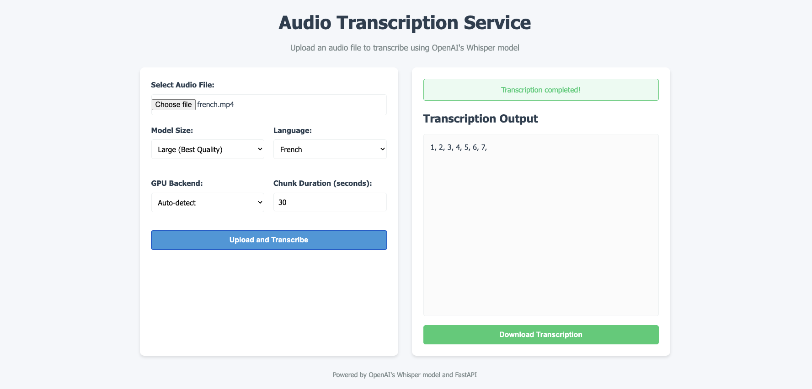

# Whisper Transcription API

A FastAPI-based web application that provides real-time audio transcription using OpenAI's Whisper model. This application allows users to upload audio files and receive streaming transcriptions as they are processed.



## Features

- Upload audio files for transcription
- Stream transcription results in real-time using Server-Sent Events
- Support for multiple languages
- Configurable model size (tiny, base, small, medium, large)
- Automatic GPU detection and utilization (CUDA, MPS, or CPU fallback)
- Interactive web interface with progress tracking
- Downloadable transcription results

## Requirements

- Python 3.8+
- FFmpeg installed on the system
- PyTorch with appropriate GPU support (optional but recommended)
- Other Python packages listed in requirements.txt

## Installation

1. Clone this repository:
```bash
git clone https://github.com/yourusername/whisper-transcription-api.git
cd whisper-transcription-api
```

2. Create a virtual environment and activate it:
```bash
python -m venv venv
source venv/bin/activate  # On Windows: venv\Scripts\activate
```

4. Install uv:
```bash
curl -LsSf https://astral.sh/uv/install.sh | sh
```

5. Synchronize the virtual environment with the requirements:
```bash
uv sync
```

4. Make sure FFmpeg is installed:
```bash
# On Ubuntu/Debian
sudo apt-get install ffmpeg

# On macOS with Homebrew
brew install ffmpeg

# On Windows with Chocolatey
choco install ffmpeg
```

## Usage

1. Start the FastAPI server:
```bash
uvicorn app.main:app --reload --host 0.0.0.0 --port 8000
```

2. Open your browser and navigate to:
```
http://localhost:8000
```

3. Upload an audio file, select your desired configuration, and start the transcription.

## API Endpoints

- `GET /`: Web interface for file uploads
- `POST /upload/`: Upload an audio file and start transcription
- `GET /stream/{job_id}`: Stream transcription results using SSE
- `GET /status/{job_id}`: Check the status of a transcription job
- `DELETE /jobs/{job_id}`: Delete a job and clean up resources

## Project Structure

```
fastapi-whisper-transcription/
├── app/
│   ├── __init__.py
│   ├── main.py              # FastAPI application
│   ├── transcriber.py       # Transcription code
│   └── templates/
│       └── index.html       # Upload form
├── static/
│   └── styles.css
├── temp/                    # Temporary files (auto-created)
├── requirements.txt
└── README.md
```

## Configuration Options

### Model Sizes
- `tiny`: Fastest, lowest quality
- `base`: Fast with acceptable quality
- `small`: Balanced speed/quality
- `medium`: Good quality, slower
- `large`: Best quality, slowest

### GPU Backends
- `auto`: Automatically detect the best available option
- `cuda`: NVIDIA GPU (CUDA)
- `mps`: Apple M1/M2 GPU (Metal Performance Shaders)
- `cpu`: CPU only (slowest)

### Languages
- Supports multiple languages including English, Portuguese, Spanish, French, etc.
- Optimized for Portuguese by default

## Customization

You can customize the transcription behavior by modifying the following:
- Language-specific post-processing in the `_fix_common_errors` method
- Chunk duration and paragraph formation logic
- UI elements and styling in the HTML template and CSS

## License

MIT
